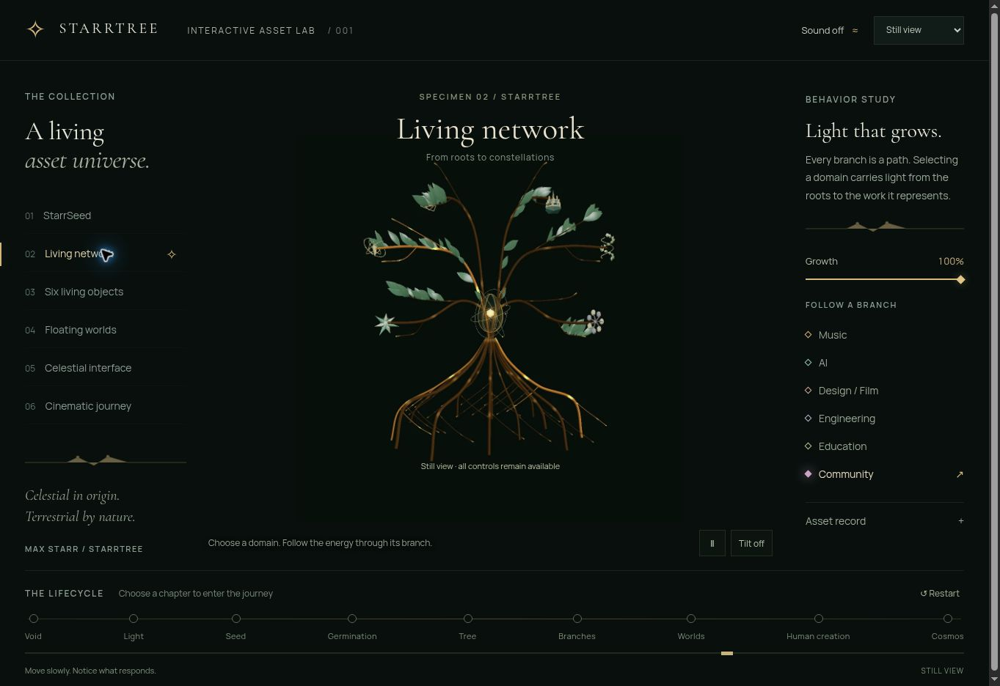

# Live Asset Lab verification — 9 September 2026

URL: https://starrtree.github.io/NewStarrTree/assets-lab/

The first publication was merged in PR #1. GitHub Actions run `34296144215` successfully installed, verified, built and deployed the compiled app. The public route returned HTTP 200 with a compiled JavaScript entrypoint and repository-relative asset paths.

## Observed in the public Chrome browser

- The page loads the collection, preview, inspector, controls and nine-chapter journey.
- Choosing Still view displays the source-rendered image.
- Activate the seed changes the action to Close the seed and growth to 100%.
- All six domain buttons change selected state and point to their distinct `domain-*.webp` image paths.
- Selecting Worlds sets journey progress to 750; the keyboard ArrowRight changes it to 751.
- The portal changes to Return to origin and reports Connection opened.
- The living-network image and surrounding layout are visible in the screenshot below.

## Issue found and addressed

This cloud browser reports WebGL as disabled. R3F renderer initialization rejected asynchronously and left the first preview empty; selecting Still manually recovered it. The follow-up adds a WebGL 2 capability check before mounting the lazy 3D scene, so unsupported browsers start in image view. Seed activation and journey chapters now select corresponding fallback images too. The temporary probe context is released immediately.

## Limits

This screenshot shows a browser displaying an image fallback. It is not evidence of GPU rendering or measured 3D performance. Physical iPhone behavior, full 3D interaction, sustained FPS, sound output, orientation permission and responsive-device layouts remain to be verified. The source-renderer tests and native EGL studies are documented separately.
